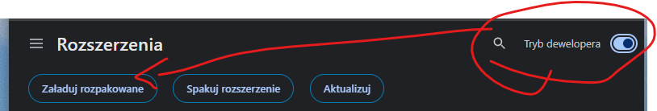
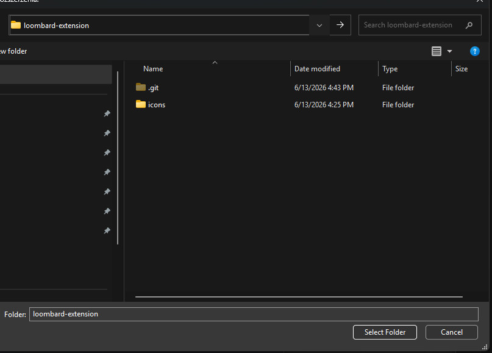

# Loombard – Data Zdjęcia (Chrome Extension)

Proste rozszerzenie do przeglądarki Chrome, które wyświetla datę dodania każdego zdjęcia na stronach produktów w serwisie **Loombard.pl**.

---

## 🚀 Instrukcja instalacji

1. **Pobierz rozszerzenie**
   Pobierz i rozpakuj archiwum ZIP z najnowszą wersją kodu źródłowego:
   👉 **[Pobierz archiwum ZIP](https://github.com/bukowa/lumbardimg/archive/refs/heads/main.zip)**

2. **Otwórz stronę rozszerzeń w Chrome**
   Uruchom przeglądarkę Chrome i w pasku adresu wpisz:
   `chrome://extensions/`

3. **Włącz tryb dewelopera i dodaj rozszerzenie**
   - W prawym górnym rogu ekranu włącz **Tryb dewelopera** (Developer mode).
   - Kliknij przycisk **Załaduj bez paczki** (Load unpacked) w lewym górnym rogu.
   
   

4. **Wybierz folder**
   - Wybierz rozpakowany wcześniej folder `loombard-extension` (katalog, w którym znajduje się plik `manifest.json`).

   

Po wykonaniu tych kroków rozszerzenie zostanie zainstalowane i będzie aktywne podczas przeglądania stron produktów na **Loombard.pl**.
